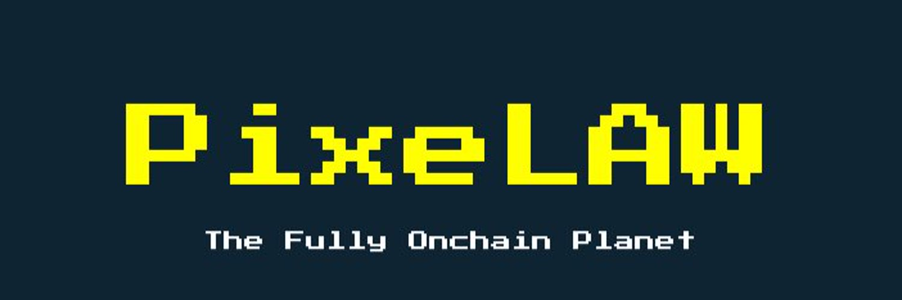

---

## PixeLAW: Autonomous Pixel Playground

PixeLAW is an anutonomous pixel playground built using [Cairo](https://book.cairo-lang.org/) and [Dojo](https://book.dojoengine.org/) on top of [Starknet](https://book.starknet.io/). PixeLAW has a core layer so that builders can create their own applications top of it. These apps share states and interact each other.

This book is dedicated to familiarizing you with PixeLAW and its [vision](https://medium.com/@syora/discovering-pixelaw-the-fully-onchain-planet-ac5e8bb40dfb) to create an [autonomous world](https://book.dojoengine.org/theory/autonomous-worlds.html).

When reading this book, you are on your way to become a Pixel World Builder.

The main contents are as follows.
- [Quickstart](./getting-started/quick-start.md)
    - [Build a PixeLAW APP](./build-app/1-build-app.md)
- [PixeLAW Architecture](./architecture/overview.md)
- [App Tutorial](./app-tutorials/tutorials.md)

### How do I get involved?

Check out our [Github](https://github.com/pixelaw/), [Twitter](https://twitter.com/0xPixeLAW), [Discord](https://t.co/jKDjNbFdZ5) and contribution guide.