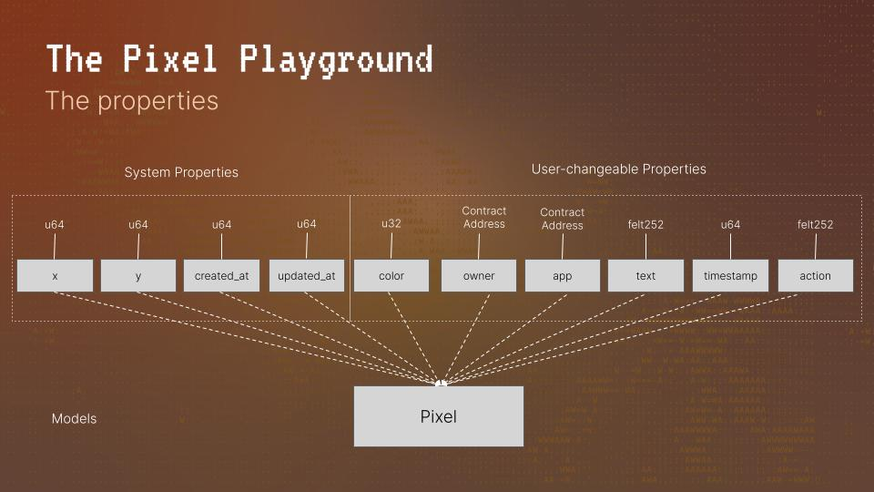
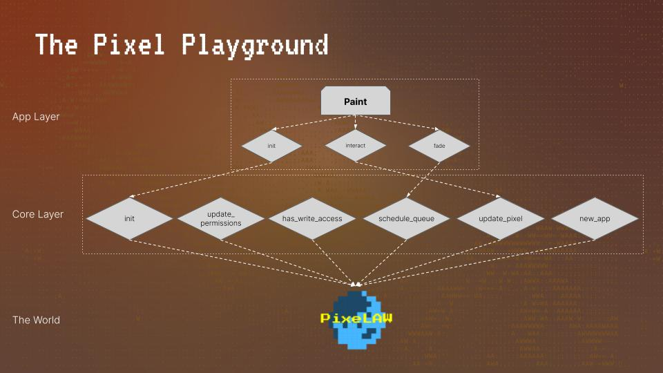
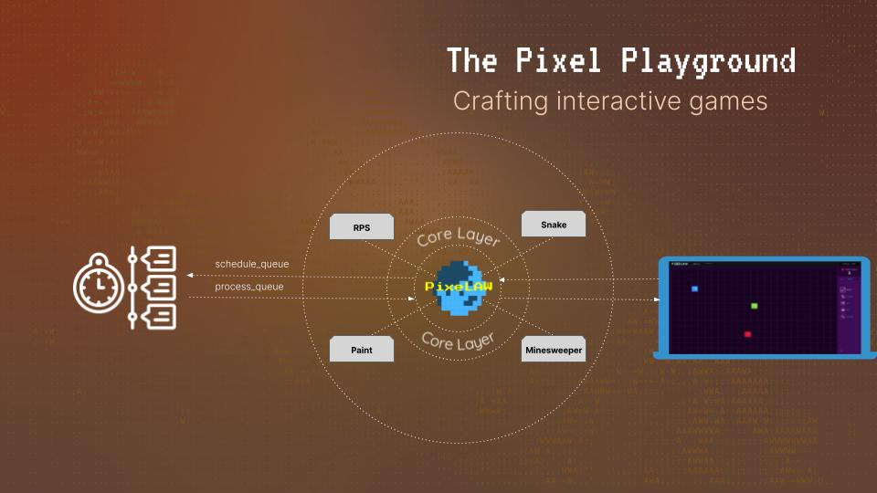

# Architecture
Here, we describe PixeLAW's architecture.

## Overview
We built core layer. Builders can create their own application by interacting with core layer.

## Core Layer
To understand core layer, we delve into components and systems for that.

### Core Components
Here are the components.

#### For System Properties
- `x`: u64
- `y`: u64
- `created_at`: u64
- `updated_at`: u64

#### For User-changeable Properties
- `app`: ContractAddress
- `color`: u32
- `owener`: ContractAddress
- `text`: felt252
- `timestamp`: u64
- `action`: felt252

### Core Systems
These systems interact with core components.
- `init`: Initialize the PixeLAW action model 
- `update_permissions`: Grant permissions to a system by the caller
- `update_app`: Updates the name of an app in the registry
- `has_write_access`: Check the access for writing
- `shedule_queue`: Shedule the process for queue
- `process_queue`: Execute the process in queue
- `update_pixel`: Update pixel information
- `get_player_address`: Get the address
- `get_system_address`: Get the address
- `new_app`: Register an app

## Applications on PixeLAW
There are already some applications top of core layer for example.

### Paint pixel
By utilizing core systems, we can create our own pixel art game.

### Sanke Game
For snake game, the queue system is important.

## Queue System
We use queue system to execute stacked processes.
