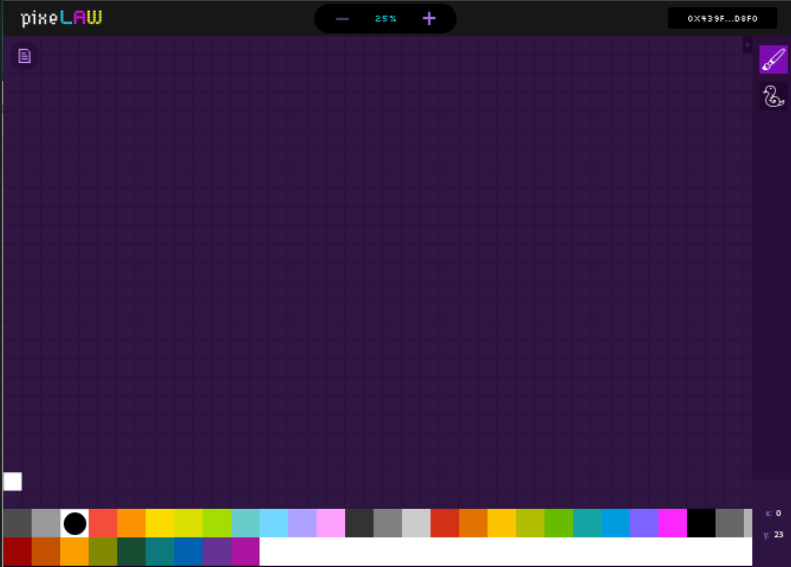

# Quick Start

## Deploy the Pixel Core locally
Everything in PixeLAW starts with the [core pixel layer](https://github.com/pixelaw/core) into which you will deploy your own app.

Let's get started by deploying the core pixel layer, which includes both the contracts and the PixeLAW front-end.

## Clone app_template

Please go to [app_template](https://github.com/pixelaw/app_template). And clone it.

```console
git clone https://github.com/pixelaw/app_template.git app_template
```

## Prerequisites

Download these libraries.

-   Dojo - install [here](https://book.dojoengine.org/getting-started/quick-start.html)
-   Scarb - install [here](https://docs.swmansion.com/scarb/download)
-   Docker - install [here](https://docs.docker.com/engine/install/)
-   Docker compose plugin - install [here](https://docs.docker.com/compose/install/)

## Run your own tests

To make sure everything is working correctly, run the following command to run tests:
```console
sozo test
```

## Deploy the Pixel Core

In order to simplify deploying PixeLAW locally, we created a docker container with all dependencies. Simply run this command in the `app_template` folder:
```console
docker compose up -d
```

## Wait for the Core to be deployed (Optional)

For convenience, you can run the following script that will print out "Ready for app deployment", once contracts fully initialised:
```console
scarb run ready_for_deployment
```

After some time (around 1 minute) you should be able to see PixeLAW running on http://localhost:3000. There is a docker-compose file in this repository specifically for running a local image of PixeLAW core. Wait until http://localhost:3000/manifests/core stops returning NOT FOUND.

You should be able to see PixeLAW in its true glory: 

If you run into any issues you can check out the [github repo](https://github.com/pixelaw/app_template/tree/main), and check out alternatives to deploy the core.

## Next Step

Awesome, you just successfully deployed the Pixel Core. 

The next step should be for you to build your own PixeLAW App. We will remain in the `app_template` repo.

Go and be a Pixel Builder and [deploy your own App to the core](../build-app/build-app.md)!