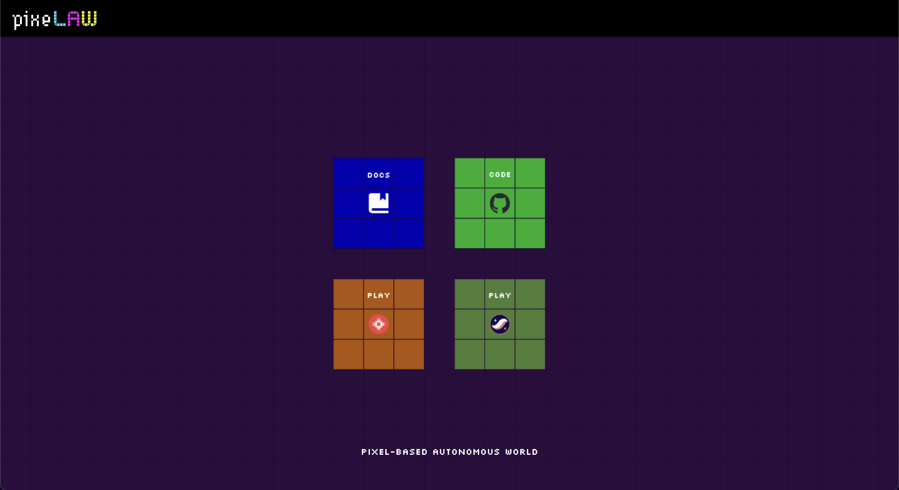

# Tutorials

## Go to Website
Firstly, please access to [PixeLAW website](https://www.pixelaw.xyz/).
Then, click one of play buttons.

## Choose An Application and Play
After click the play button, you can see such a screen.

The icons on the right represent game applications.
From top to bottom: 
- 2048: Click buttons and slide tiles to create bigger numbers.
- Tic Tac Toe against an AI Agent
- Snake: Specify the direction to move.
- Minesweeper: Specify the grid size and number of mines to play Minesweeper.
- Paint: Paint a pixel.
- Hunter: Basically paint a pixel. But you might see a star if you are luckey.
- Rock-Paper-Scissors: Play RPS game against other users.